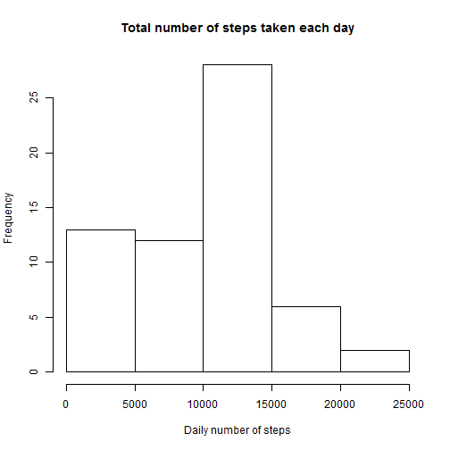
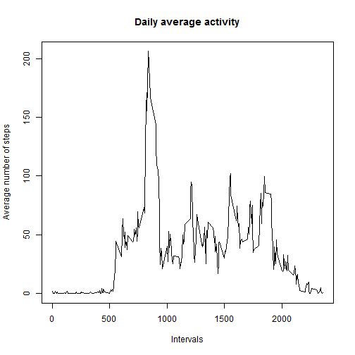
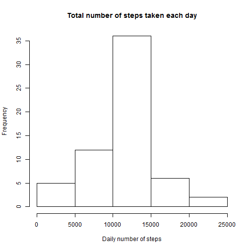
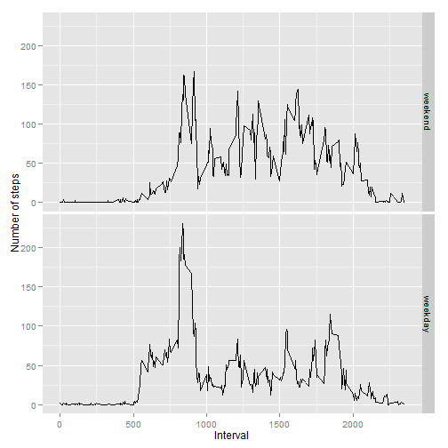

## Loading and preprocessing the data
It is assumed that the data file is in the working directory.

Reading the data file.

```r
data <- read.csv(unz("activity.zip", "activity.csv"))
```


## What is mean total number of steps taken per day?
### 1. Making a histogram of the total number of steps taken each day.

First, we calculate the total number of steps per day by the _aggregate_ function,
and then we draw the histogram for the daily number of steps.


```r
aggdata <-aggregate(data$steps, by=list(data$date), FUN=sum, na.rm=TRUE)
hist(aggdata$x, main="Total number of steps taken each day",xlab="Daily number of steps")
```

 

### 2. Calculate and report the mean and median total number of steps taken per day

The mean and the median are then calcualted from the daily steps.

Mean number of steps per day is: 

```r
mean(aggdata$x)
```

```
## [1] 9354
```

Median number of steps per day is: 

```r
median(aggdata$x)
```

```
## [1] 10395
```

## What is the average daily activity pattern?
### 1. Making a time series plot of the 5-minute interval and the average number of steps taken, averaged across all days.

Calculating the number of steps averages across the all days in the data set.

```r
aggIntervals <-aggregate(data$steps, by=list(data$interval), FUN=mean, na.rm=TRUE)
```

Plotting data.

```r
plot(aggIntervals$Group.1, aggIntervals$x, type="l", main="Daily average activity", ylab="Average number of steps", xlab="Intervals")
```

 

### 2. Which 5-minute interval, on average across all the days in the dataset, contains the maximum number of steps?


```r
index<- which.max(aggIntervals$x)
maxInterval<-aggIntervals$Group.1[index]
maxSteps<-aggIntervals$x[index]
```

The interval number 835 contains maximum number of steps 206.1698.  


## Imputing missing values

### 1. Calculate and report the total number of missing values in the dataset (i.e. the total number of rows with NAs)


```r
missing<-sum(!complete.cases(data))
```

There are 2304 records which contains missing values.

### 2. Devise a strategy for filling in all of the missing values in the dataset. The strategy does not need to be sophisticated. For example, you could use the mean/median for that day, or the mean for that 5-minute interval, etc.


Missing values will be imputed as an average over particular interval 

### 3. Create a new dataset that is equal to the original dataset but with the missing data filled in.

New data set _data1_ will be created which contains no missing values.

```r
library(plyr)
data1<-join(data,ddply(data,.(interval),summarise,mean=mean(steps, na.rm=T)),by=("interval"),type="right")
data1$steps[is.na(data1$steps)]<-data1$mean[is.na(data1$steps)]
```

### 4. Make a histogram of the total number of steps taken each day and Calculate and report the mean and median total number of steps taken per day. Do these values differ from the estimates from the first part of the assignment? What is the impact of imputing missing data on the estimates of the total daily number of steps?

Calculating the total number of steps per day,
and drawing the histogram for the daily number of steps.


```r
aggdata2 <-aggregate(data1$steps, by=list(data1$date), FUN=sum)
hist(aggdata2$x, main="Total number of steps taken each day",xlab="Daily number of steps")
```

 

Mean number of steps per day is: 

```r
mean(aggdata2$x)
```

```
## [1] 10766
```

Median number of steps per day is: 

```r
median(aggdata2$x)
```

```
## [1] 10766
```

These values differ from previously calculated mean and median. It seems that the selected method for data imputation made the data distribution more symmetrical, so now the mean is equal to median value.  


## Are there differences in activity patterns between weekdays and weekends?

### 1. Create a new factor variable in the dataset with two levels - "weekday" and "weekend" indicating whether a given date is a weekday or weekend day.


```r
dates<-strptime(data1$date, "%Y-%m-%d")
weekday<-weekdays(dates, abbreviate = T)
data1$weekdays<-as.factor(ifelse(weekday %in% c("Sat","Sun"), "weekend", "weekday"))
data1$weekdays <- factor(data1$weekdays, levels=rev(levels(data1$weekdays)) )
```

### 2. Make a panel plot containing a time series plot (i.e. type = "l") of the 5-minute interval (x-axis) and the average number of steps taken, averaged across all weekday days or weekend days (y-axis).

Aggregating over intervals and weekdays.


```r
aggIntervals2 <-aggregate(data1$steps, by=list(data1$interval, data1$weekdays), FUN=mean)
```

Plotting average number of steps according to 5-min intervals. Using ggplot. 


```r
library(ggplot2)
```

```
## Need help? Try the ggplot2 mailing list: http://groups.google.com/group/ggplot2.
```

```r
g<-ggplot(aggIntervals2, aes(Group.1, x))
g+geom_line()+facet_grid(Group.2 ~.)+labs(x="Interval", y="Number of steps")        
```

 
